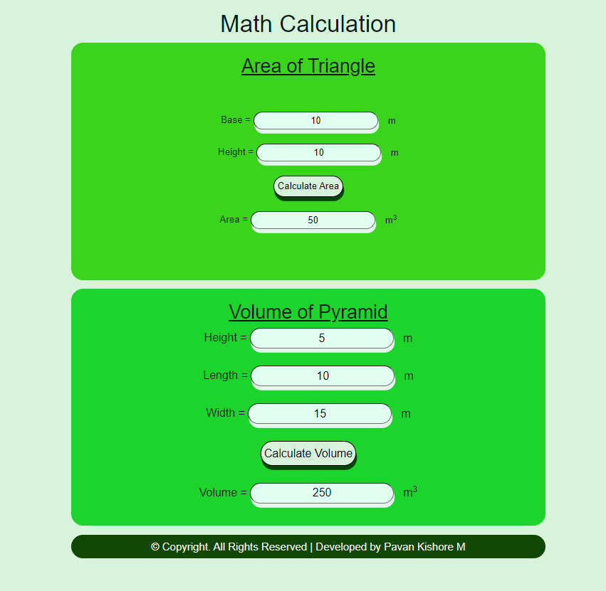

# AngularCalculation

# Web Page for Mathematical Calculations using Angular

## AIM:
To design a dynamic website to perform mathematical calculations using Angular Framwork

## DESIGN STEPS:

### Step 1:

Requirement collection.

### Step 2:

Creating the layout using HTML and CSS in component.html file

### Step 3:

Write typescript to perform the calculations.

### Step 4:

Validate the layout in various browsers.

### Step 5:

Validate the HTML code.

### Step 6:

Publish the website in the given URL.

## PROGRAM :
### index.html:
```
<!doctype html>
<html lang="en">
<head>
  <meta charset="utf-8">
  <title>MathCalculations</title>
  <base href="/">
  <meta name="viewport" content="width=device-width, initial-scale=1">
  <link rel="icon" type="image/x-icon" href="favicon.ico">
  <link rel="stylesheet" href="./styles.css">
  <link rel="stylesheet" href="https://stackpath.bootstrapcdn.com/bootstrap/4.3.1/css/bootstrap.min.css" integrity="sha384-ggOyR0iXCbMQv3Xipma34MD+dH/1fQ784/j6cY/iJTQUOhcWr7x9JvoRxT2MZw1T" crossorigin="anonymous">
</head>
<body>
  <app-root></app-root>
</body>
</html>
```
### pyramid.component.ts:
```
<div>
    Height = <input type="text" [(ngModel)]="height"><a>m</a><br/>
    <br/>
    Length = <input type="text" [(ngModel)]="length"><a>m</a><br/>
    <br/>
    Width = <input type="text" step='0.01' [(ngModel)]="width"><a>m</a><br/>
    <br/>
    <input class="button" type="button" value="Calculate Volume" (click)="onCalculateVolume()"><br/>
    <br/>
    Volume = <input type="text"  [value]="volume"><a>m<sup>3</sup></a>
</div>
```
### pyramid.component.html:
```
import { Component } from "@angular/core";

@Component({
    selector:"Pyramid-Volume",
    templateUrl:"./pyramid.component.html"
})
export class PyramidComponent{
    height:number;
    length:number;
    width:number;
    volume: number;
    constructor(){
        this.height = 5
        this.length = 10
        this.width = 15
        this.volume = ((this.height * this.length * this.width)/3)
    }
    onCalculateVolume(){
        this.volume = (this.height * this.length * this.width)/3
    }
}
```
### triangle.component.ts:
```
import { Component } from "@angular/core";

@Component({
    selector:"Triangle-Area",
    templateUrl:"./triangle.component.html"
})
export class TriangleComponent{
    base: number;
    height: number;
    area: number;
    constructor(){
        this.base = 10
        this.height = 10
        this.area = (this.base*this.height)/2
    }
    onCalculateArea(){
        this.area = (this.base*this.height)/2
    }
}
```

### triangle.component.html:
```
<div>
    Base = <input type="text" [(ngModel)]= "base"><a>m</a><br/>
    <br/>
    Height = <input type="text" [(ngModel)]= "height"><a>m</a><br/>
    <br/>
    <input class="button" type = "button" (click)=" onCalculateArea()" value="Calculate Area"><br/>
    <br/>
    Area = <input type="text" readonly value="0" [value]= "area"><a>m<sup>3</sup></a>
</div>
```
### app.component.html:
```
<body>
    <div class="container">
        <h1>Math Calculation</h1>
        <div class="content">
            <h2 class="padding"><u>Area of Triangle</u></h2>
            <Triangle-Area class="forms, padding"></Triangle-Area>
        </div>
        <div class="content1">
            <h2><u>Volume of Pyramid</u></h2>
            <Pyramid-Volume class="forms"></Pyramid-Volume>
        </div>
        <div class="footer">
            &copy; Copyright. All Rights Reserved | Developed by Nithishkumar P
        </div>
    </div>

</body>
```
## OUTPUT:

## Result:
A dynamic website has been designed to perform mathematical calculations using Angular Framwork.
